# ParlAI Agent examples with PyTorch, Chainer and TensorFlow


ParlAI is a unified platform for __training and evaluating dialog models across many tasks__.  
Currently, the following agents are implemented in this repository.  

- RNNAgent by PyTorch
- RNNAgent by Chainer
- RNNAgent by TensorFlow
- AttentionAgent (seq2seq with Attention) by PyTorch
- MemN2NAgent (End-To-End Memory Networks) by Chainer
- MemN2NAgent (End-To-End Memory Networks) by PyTorch __New!__
- SaveAgent (Save losses and attention weights)
- visualization.ipynb (visualize valid and test results, losses and attention weights)

I will implement it soon.

- EntNetAgent (Recurrent Entity Networks) by PyTorch
- RelNetAgent (Relation Networks) by PyTorch
- GeneralDictionaryAgent (Use sub-word, sentencepiece and character-level tokenizer)

I also wrote an article on ParlAI introduction in Japanese. Please see [here](http://deeplearning.hatenablog.com/entry/parlai).  


## Usage


Please download and install ParlAI first.  

```bash
git clone https://github.com/facebookresearch/ParlAI.git ~/ParlAI
cd ~/ParlAI

pip install -r requirements.txt
sudo python setup.py develop
```

Then download and put this repository in `~/ParlAI/parlai/`.  

```bash
git clone https://github.com/ryonakamura/parlai_agents.git
mv parlai_agents ~/ParlAI/parlai/
```


## Simple Agents


bAbI is a pure text-based QA dataset [Weston, 2015]. There are 20 tasks, each corresponding to a particular type of reasoning, such as deduction, induction, or counting.  

According to [Sukhbaatar, NIPS 2015], the mean test accuracy by LSTM in bAbI All 10k is 63.6%.  
The following RNNAgent achieves similar mean test accuracy in any library.  

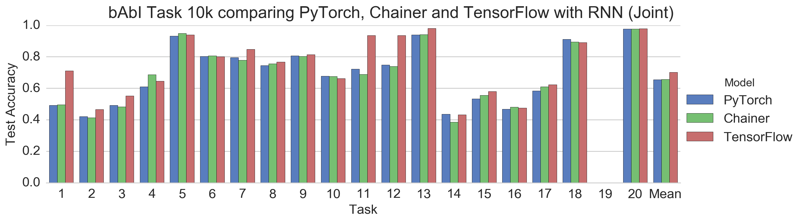

Note that the correct labels in Task 19 (path finding) are two words, but RNN generates only one word.  
The correct labels in Task 8 (lists/sets) also has two or more words, but the majority is one word.  

The meaning of the arguments are as follows.  

- `-m`: the model class name, should match `parlai.parlai_agents.<directory_name>.<file_name>:<class_name>`
- `-t`: ParlAI task(s), e.g. `babi:Task1k:1` or `babi,cbt`
- `-mf`: model file name for loading and saving models
- `-e`: number of epochs
- `-rnn`: choose GRU or LSTM
- `-bs`: batch size for minibatch training schemes
- `-hs`: size of the hidden layers and embeddings
- `-nl`: number of hidden layers
- `-lr`: learning rate
- `-dr`: dropout rate
- `-ltim`: log every n secs
- `-vtim`: validation every n secs

I examined the simple benchmark of 1000 parleys (iterations) speed on single GPU.  

in Joint Training  

| PyTorch | Chainer | TensorFlow |
|---|---|---|
| 96 sec | 157 sec | 320 sec |

in Single Training (Task 1)  

| PyTorch | Chainer | TensorFlow |
|---|---|---|
| 36 sec | 71 sec | 64 sec |

TensorFlow may be slow because it doesn't use truncated BPTT.  

### RNNAgent by PyTorch

PyTorch is an easy and powerful way to implement ParlAI Agent.  
When using GPU PyTorch is 1.5 ~ 2 times faster than Chainer.  

```bash
cd ~/ParlAI
python examples/train_model.py -m parlai.parlai_agents.pytorch_rnn.pytorch_rnn:RNNAgent -t babi:Task1k:1 -mf './parlai/parlai_agents/pytorch_rnn/model_file/babi1' -e 20 -rnn GRU -bs 32 -hs 64 -nl 2 -lr 0.5 -dr 0.2 -ltim 2 -vtim 30
```

### RNNAgent by Chainer

This implementation use multiple inheritance of ParlAI's `Agent` class and Chainer's `Chain` classe.  
You can choose RNN from `links.NStepGRU` or `links.NStepLSTM`.  

```bash
cd ~/ParlAI
python examples/train_model.py -m parlai.parlai_agents.chainer_rnn.chainer_rnn:RNNAgent -t babi:Task1k:1 -mf './parlai/parlai_agents/chainer_rnn/model_file/babi1' -e 20 -rnn GRU -bs 32 -hs 64 -nl 2 -lr 0.5 -dr 0.2 -ltim 2 -vtim 30
```

### RNNAgent by TensorFlow

TensorFlow can handle variable length input using `tf.nn.dynamic_rnn`.  
`dynamic_rnn` internally executes loop processing to unroll time series using `control_flow_ops.while_loop` (same as `tf.while_loop`).  

If you want to run with only CPU on the GPU server, you can set the environment variable to `CUDA_VISIBLE_DEVICES=""`.  

```bash
cd ~/ParlAI
python examples/train_model.py -m parlai.parlai_agents.tensorflow_rnn.tensorflow_rnn:RNNAgent -t babi:Task1k:1 -mf './parlai/parlai_agents/tensorflow_rnn/model_file/babi1' -e 20 -rnn GRU -bs 32 -hs 64 -nl 2 -lr 0.5 -dr 0.2 -ltim 2 -vtim 30
```


## More Advanced Agents


### AttentionAgent by PyTorch

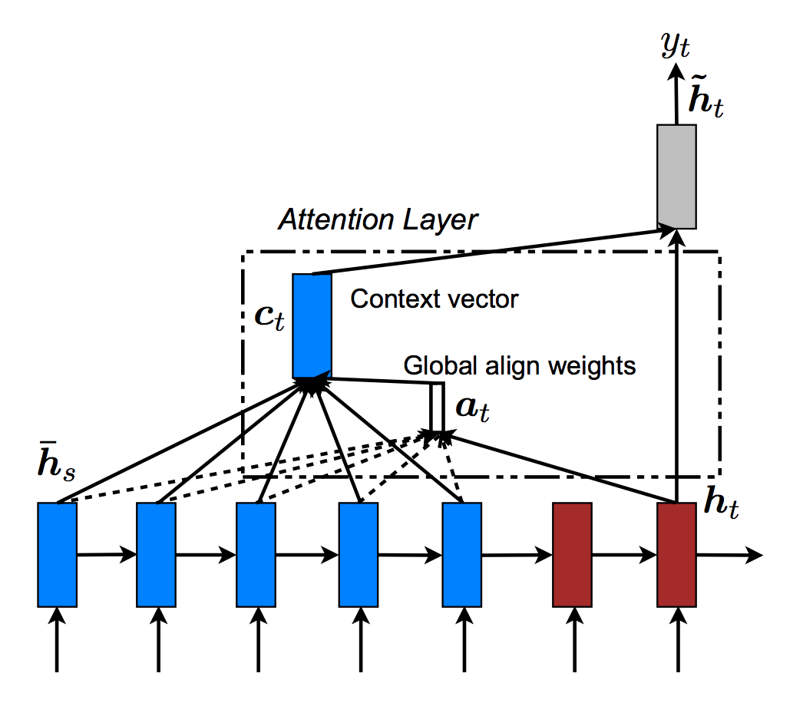

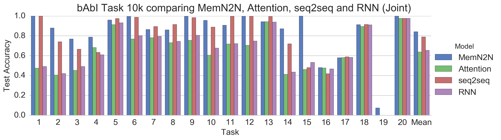

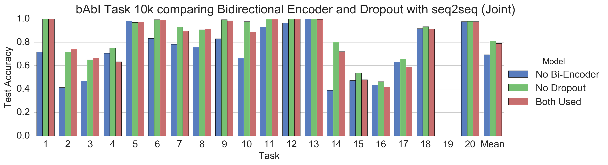

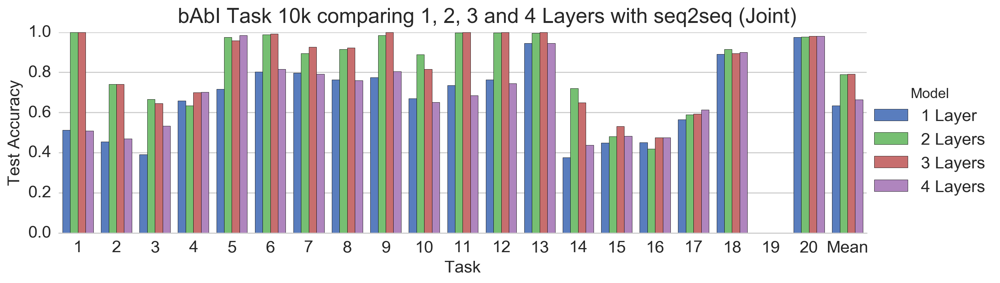

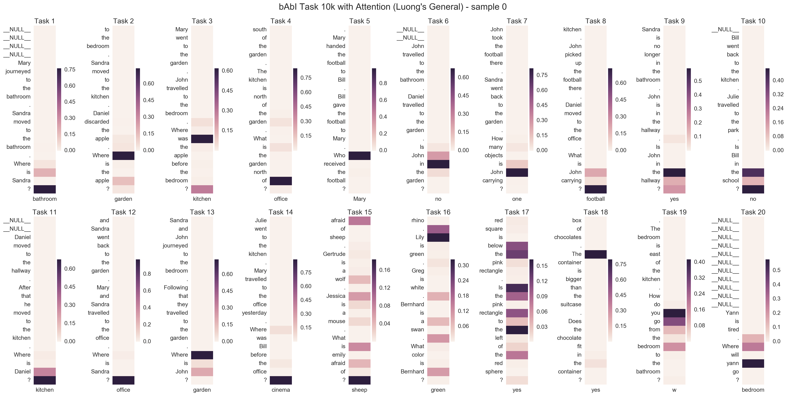

The meaning of the additional arguments are as follows.  

- `-bi`: if True, use a bidirectional encoder for the first layer
- `-atte`: if True, use an Luong's attention
- `-cont`: if True, use only a context vector without using decoder query for the final output
- `-sf`: select score function for attention from dot, general, concat
- `-tf`: teacher forcing ratio

```bash
cd ~/ParlAI
python examples/train_model.py -m parlai.parlai_agents.pytorch_attention.pytorch_attention:AttentionAgent -t babi:Task1k:1 -mf './parlai/parlai_agents/pytorch_attention/model_file/babi1' -e 20 -rnn GRU -bi True -atte True -sf general -tf 1. -bs 32 -hs 64 -nl 2 -lr 0.5 -dr 0.2 -ltim 2 -vtim 30
```


### MemN2NAgent by Chainer

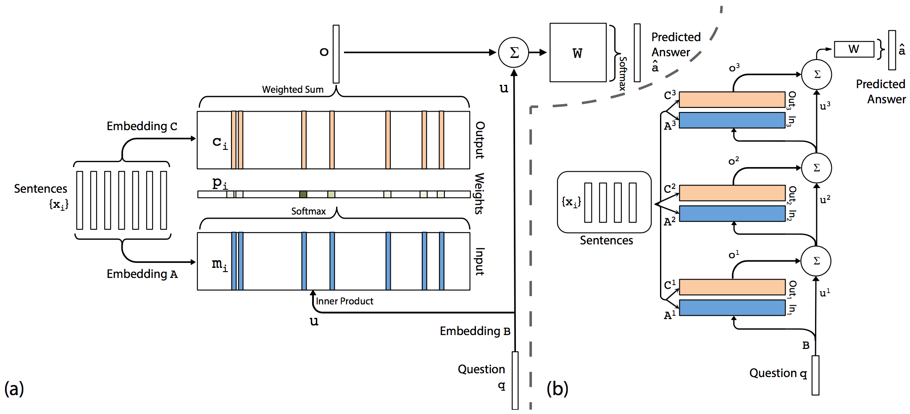

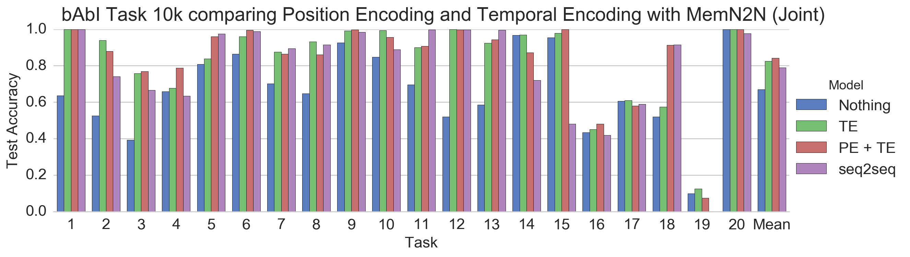


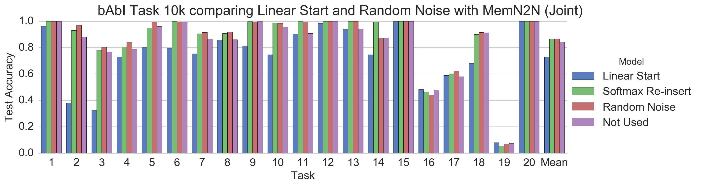

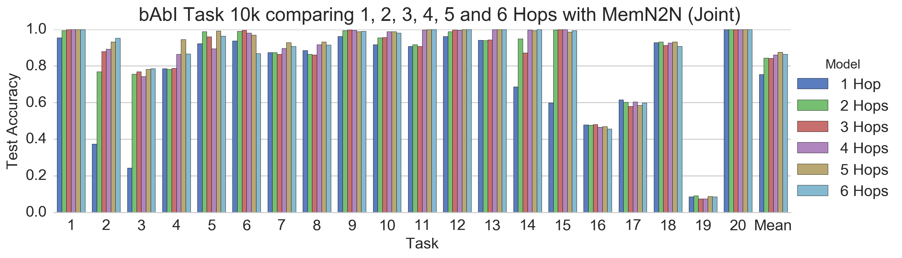

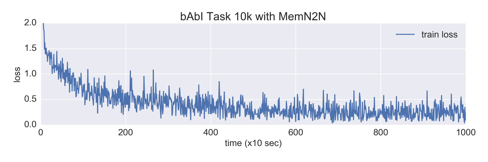

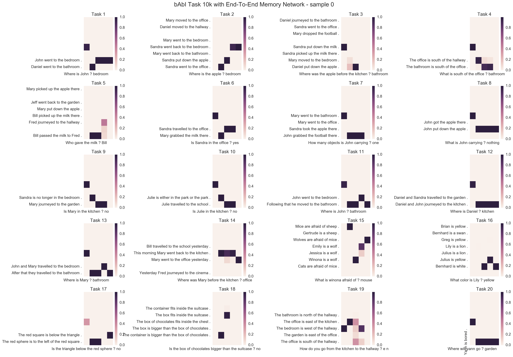

The meaning of the additional arguments are as follows.  

- `-ms`: size of the memory (both key and value)
- `-nl`: number of memory layers (hops)
- `-wt`: select weight tying from Adjacent, Layer-wise, Nothing
- `-pe`: if True, use a Position Encoding for word embedding
- `-te`: if True, use a Temporal Encoding for sentence memorization
- `-rn`: if True, use a Random Noise to regularize TE
- `-ls`: if True, use a Linear Start (remove softmax for the memory layers)
- `-opt`: select optimizer from SGD, AdaGrad, Adam

Chainer version  

```bash
cd ~/ParlAI
python examples/train_model.py -m parlai.parlai_agents.chainer_memn2n.chainer_memn2n:MemN2NAgent -t babi:Task1k:1 -mf './parlai/parlai_agents/chainer_memn2n/model_file/babi1' -e 100 -bs 32 -hs 20 -ms 50 -nl 3 -wt Adjacent -pe True -te True -rn True -ls False -opt Adam -lr 0.05 -ltim 2 -vtim 60 -vp -1
```

PyTorch version  

```bash
cd ~/ParlAI
python examples/train_model.py -m parlai.parlai_agents.pytorch_memn2n.pytorch_memn2n:MemN2NAgent -t babi:Task1k:1 -mf './parlai/parlai_agents/pytorch_memn2n/model_file/babi1' -e 100 -bs 32 -hs 20 -ms 50 -nl 3 -wt Adjacent -pe True -te True -rn True -ls False -opt Adam -lr 0.05 -ltim 2 -vtim 60 -vp -1
```

### Outperform the Results of the Paper!

Benchmark results to compare this repo implementation, the author's
[original Matlab code](https://github.com/facebook/MemNN/tree/master/MemN2N-babi-matlab) 
on the [bAbI tasks](http://fb.ai/babi) and the paper description.  

Default Configuration: 3 Hops, Position Encoding (PE), Temporal Encoding (TE), Linear Start (LS), Random Noise (RN) and Adjacent Weight Tying.  

- this repo: No weight tying, No Linear Start, 5 Hops, Hidden Size 128 and Adam (Annealing). It failed at linear start. (trained only once)  
- matlab: [check it](https://github.com/vinhkhuc/MemN2N-babi-python/tree/master/bechmarks)
- paper: repeated 10 times with different random initializations, and picked the one with the lowest training error. [check it](https://arxiv.org/abs/1503.08895)  

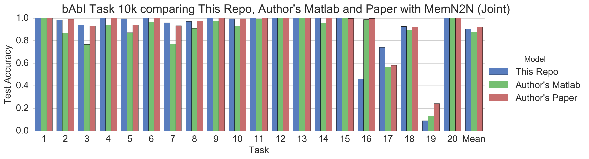

bAbI Task paper consider a task successfully passed if ≥ 95% accuracy is obtained.  

In the best results of the paper, __14/20__ tasks succeeded.  
The best settings of this repo has succeeded in __15/20__ tasks!  

### Visualize Position Encoding

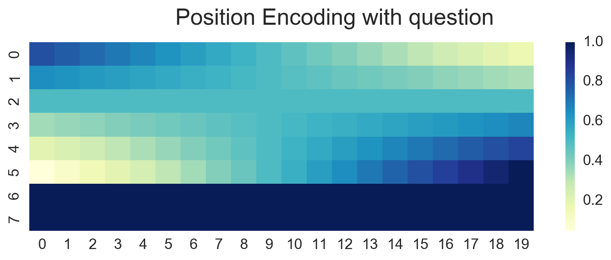


## Other Agents


### SaveAgent

Save losses and attention weights.  

The meaning of the arguments are as follows.  

- `-sltim`, `--save-loss-every-n-secs`: second interval to save losses
- `-sae`, `--save-attention-exs`: maximum number of examples to save attention weights


## Contact


If you have any questions or anything, please do not hesitate to contact me or post on my Github Issues page.

- @_Ryobot on Twitter
- nakamura.ryo.nm8[at]is.naist.jp


## License


All codes in this repository are BSD-licensed.
